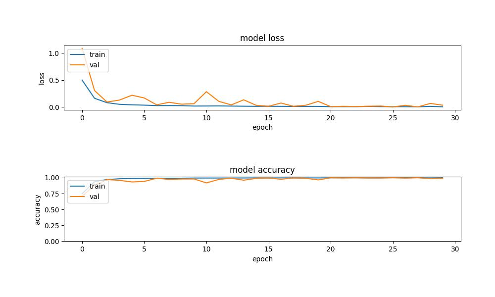
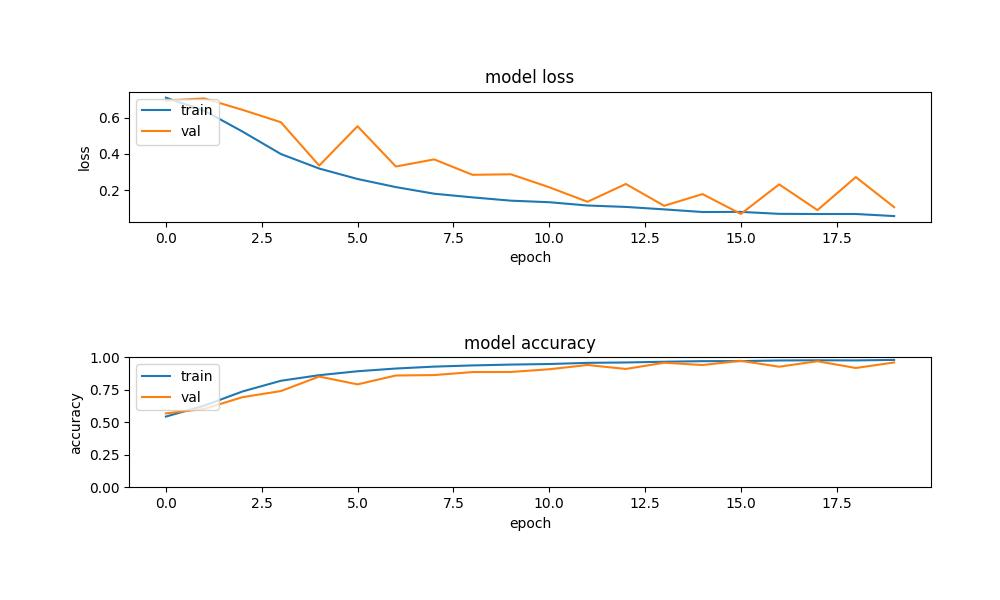

# Hand gesture regconition
---
# Thư viện 
  - ## opencv-python (Version 4.5 hoặc cũ hơn)
  - ## tensorflow
  - ## numpy
  - ## matplotlib
---
# Bài toán
  * ## Nhận diện cử chỉ tay, giới hạn trong việc xác định những ngón tay nào đang giơ
  * ## Ứng dụng Zero-shot learning
  * ## Mô hình được huấn luyện với dữ liệu từ các seen classes, bao gồm các cách giơ ngón tay khác nhau, trừ các cách giơ cùng lúc 4 ngón tay ( 15 lớp tất cả)
  * ## Yêu cầu của mô hình cần chỉ ra các ngón tay nào đang giơ, của các dữ liệu test từ các unseen classes, là các cách giơ cùng lúc 4 ngón tay (4 lớp tất cả)
  * ## Xây dựng 5 classifier one-vs-rest riêng biệt, mỗi dự đoán của 1 classifier đại diện cho 1 ngón tay có đang giơ hay không

# Dữ liệu
  * ## Dữ liệu training, hình ảnh bàn tay tự tạo, sử dụng camera laptop
  * ## Ảnh được cắt với kích thước 300x300, lưu trong thư mục 'data', gồm 25,000 ảnh
  * ## Dữ liệu test được tạo tương tự, chia thành 2 loại
    * ### bộ test của các unseen classes, lưu trong thư mục 'test', gồm 1,600 ảnh
    * ### bộ test của các seen class đã được train, lưu trong thư mục 'seen_test' gồm 1,500 ảnh

# Mô hình của classifier
  * ## Mô hình được nhóm tham khảo từ các mô hình có sẵn, đạt kết quả tốt trong phân loại ảnh
  * ## Một số mô hình được nhóm áp dụng, chỉnh sửa tham số để phù hợp với bài toán:
    * ### VGG16
    * ### Resnet50
    * ### Inception+resnet ( Chưa có kết quả test do thời gian training quá lâu)

- # Kết quả training
  - ## Mô hình áp dụng Resnet, size ảnh input 64x64x3:
    - ### Training classifier 0:
      - 
    - ### Training classifier 1:
      - 
    - ### Training classifier 2:
      - 
    - ### Training classifier 3:
      - 
    - ### Training classifier 4:
      - 
  - ## Mô hình áp dụng Inception-resnet, size ảnh input 32x32x3:
    - ### Training classifier 0:
      - 
    - ### Training classifier 1:
      - 
    - ### Training classifier 2:
      - 
    - ### Training classifier 3:
      - 
    - ### Training classifier 4:
      - 
  - ## Mô hình áp dụng resnet, size ảnh input 32x32x3:
    - ### Training classifier 0:
      - 
    - ### Training classifier 1:
      - 
    - ### Training classifier 2:
      - 
    - ### Training classifier 3:
      - 
    - ### Training classifier 4:
      - 
# Kết quả test
 - ## Model áp dụng Resnet, size ảnh input 64x64x3:
   - 
 - ## Modle áp dụng Inception-resnet, size ảnh input 32x32x3:
   - 

# Kết quả model sau khi train được lưu trong thư mục 'models'
> **_Model Classifier cho ngón tay i sẽ kết thúc dạng 'i.h5', i = 0 tương ứng với ngón tay cái, i = 4 tương ứng với ngón út_**

